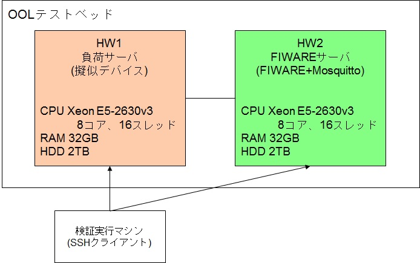
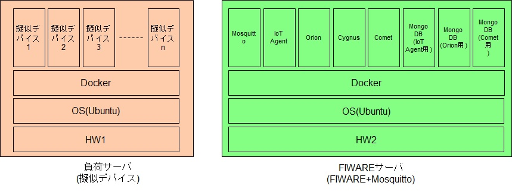
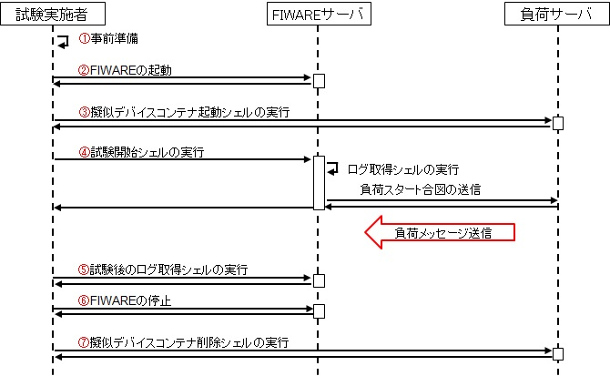
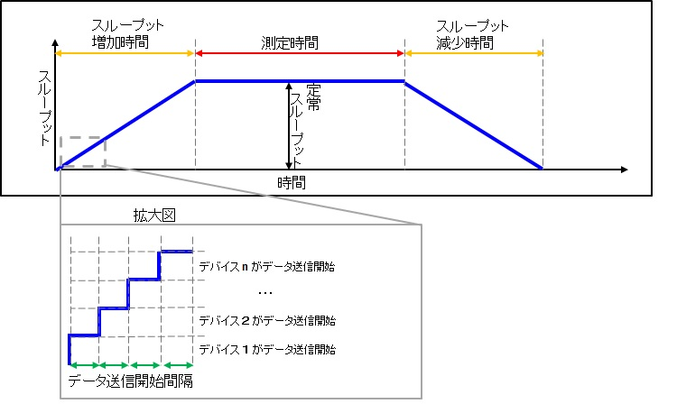
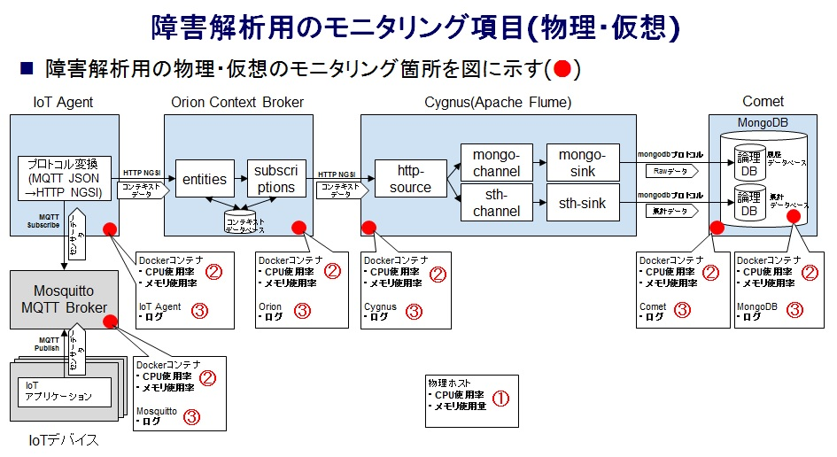
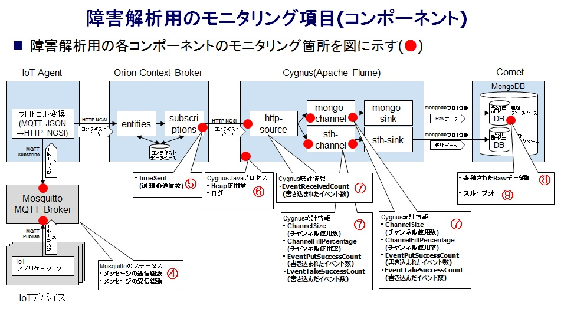

# 目次
-  [負荷検証](#負荷検証)
    -  [環境構築](#環境構築)
        -  [FIWAREサーバの構築](#FIWAREサーバの構築)
        -  [負荷サーバの構築](#負荷サーバの構築)
    -  [負荷試験実施手順](#負荷試験実施手順)
        -  [1.事前準備](#1事前準備)
        -  [2.FIWAREの起動　【FIWAREサーバで作業を行う】](#2FIWAREの起動FIWAREサーバで作業を行う)
        -  [3.擬似デバイスコンテナ起動シェルの実行　【負荷サーバで作業を行う】](#3擬似デバイスコンテナ起動シェルの実行負荷サーバで作業を行う)
        -  [4.試験開始シェルの実行　【FIWAREサーバで作業を行う】](#4試験開始シェルの実行FIWAREサーバで作業を行う)
        -  [5.試験後のログ取得シェルの実行　【FIWAREサーバで作業を行う】](#5試験後のログ取得シェルの実行FIWAREサーバで作業を行う)
        -  [6.FIWAREの停止　【FIWAREサーバで作業を行う】](#6FIWAREの停止FIWAREサーバで作業を行う)
        -  [7.擬似デバイスコンテナの削除シェルの実行　【負荷サーバで作業を行う】](#7擬似デバイスコンテナの削除シェルの実行負荷サーバで作業を行う)
    - [ログ取得シェルの概要とログの見方](#ログ取得シェルの概要とログの見方)
        -  [① 物理ホストのリソース](#-物理ホストのリソース)
        -  [② Dockerコンテナのリソース](#-dockerコンテナのリソース)
        -  [③ Dockerコンテナのログ](#-dockerコンテナのログ)
        -  [④ Mosquittoのメッセージの送受信数](#-mosquittoのメッセージの送受信数)
        -  [⑤ Orionの通知の送信数](#-orionの通知の送信数)
        -  [⑥ CygnusのJavaのプロセス](#-cygnusのjavaのプロセス)
        -  [⑦ Cygnusの統計情報](#-cygnusの統計情報)
        -  [⑧ Cometに蓄積されたRawデータ数](#-cometに蓄積されたrawデータ数)
        -  [⑨ スループット](#-スループット)

# 負荷検証

構成例



コンポーネント構成



## 環境構築
### FIWAREサーバの構築

|項目|Version|
|:-:|:-:|
|OS|Ubuntu 16.04 LTS|
|docker|18.06.1-ce, build e68fc7a|
|docker-compose|1.22.0, build f46880fe|

#### Dockerのインストール

公式手順に従いインストールを行う
https://docs.docker.com/install/linux/docker-ce/ubuntu/

##### インストール手順

パッケージインデックスを更新

```bash
~$ sudo apt-get update
```

HTTPS経由でリポジトリを使用できるようにするためのパッケージをインストール

```bash
~$ sudo apt-get install \
  apt-transport-https \
  ca-certificates \
  curl \
  software-properties-common
```

```bash
~$ curl -fsSL https://download.docker.com/linux/ubuntu/gpg | sudo apt-key add -
```

Dockerの公式GPGキーを追加

```bash
~$ sudo apt-key fingerprint 0EBFCD88
```

フィンガープリント9DC8 5822 9FC7 DD38 854A E2D8 8D81 803C 0EBF CD88の最後の8文字を検索して、フィンガープリントを持つキーが手元にあることを確認

```bash
~$ sudo add-apt-repository \
 "deb [arch=amd64] https://download.docker.com/linux/ubuntu \
 $(lsb_release -cs) \
 stable"
```

パッケージインデックスを更新

```bash
~$ sudo apt-get update
```

リポジトリで利用可能なバージョンを一覧表示

```bash
~$ apt-cache madison docker-ce
```

特定バージョン(`docker-ce=18.06.1~ce~3-0~ubuntu`)のDockerをインストール

```bash
~$ sudo apt-get install docker-ce=18.06.1~ce~3-0~ubuntu
```

dockerグループを作成
　`groupadd: group 'docker' already exists`と表示されるが問題ない
 
```bash
~$ sudo groupadd docker
groupadd: group 'docker' already exists
```

自分のユーザーをdockerグループに追加

```bash
~$ sudo usermod -aG docker $USER
```

ログアウトし再ログイン後バージョンの確認

```bash
~$ docker --version
Docker version 18.06.1-ce, build e68fc7a
```

#### Docker Composeのインストール

公式手順に従いインストールを行う
https://docs.docker.com/compose/install/#install-compose

##### インストール手順

特定バージョン(1.22.0)のDocker Composeをダウンロード

```bash
~$ sudo curl -L "https://github.com/docker/compose/releases/download/1.22.0/docker-compose-$(uname -s)-$(uname -m)" -o /usr/local/bin/docker-compose
```

実行可能権限をバイナリに適用

```bash
~$ sudo chmod +x /usr/local/bin/docker-compose
```

/usr/binパスにシンボリックリンクの作成

```bash
~$ sudo ln -s /usr/local/bin/docker-compose /usr/bin/docker-compose
```

バージョンの確認

```bash
~$ docker-compose --version
docker-compose version 1.22.0, build f46880fe
```

#### 検証を実施するために必要なパッケージのインストール

- sysstat　([fiware-poc/poc/performance-test/shell/before_logging/get_host_metrics.sh](https://github.com/oolorg/fiware-poc/blob/master/pocs/performance-test/shell/before_logging/get_host_metrics.sh)でシステムの状態(CPU,メモリ,ディスクI/Oなど)監視のために使用)
- jq　([fiware-poc/poc/performance-test/shell/after_logging/get_throughput.sh](https://github.com/oolorg/fiware-poc/blob/master/pocs/performance-test/shell/after_logging/get_throughput.sh)、[fiware-poc/poc/performance-test/shell/before_logging/get_cygnus_metrics.sh](https://github.com/oolorg/fiware-poc/blob/master/pocs/performance-test/shell/before_logging/get_cygnus_metrics.sh)でJSONから値を抽出するために使用)
- mosquitto-clients　([fiware-poc/poc/performance-test/shell/init/start_init.sh](https://github.com/oolorg/fiware-poc/blob/master/pocs/performance-test/shell/init/start_init.sh)でMQTTメッセージ送信のために使用)

```bash
~$ sudo apt install sysstat jq mosquitto-clients
```

#### gitのクローン

```bash
~$ cd ~/
~$ git clone https://github.com/oolorg/fiware-poc.git
```

### 負荷サーバの構築

|項目|Version|
|:-:|:-:|
|OS|Ubuntu 16.04 LTS|
|docker|18.06.1-ce, build e68fc7a|

#### Dockerのインストール

[[FIWAREサーバの構築]の[dockerのインストール]](#dockerのインストール)手順に従いdockerのインスールを行う

#### 負荷をかけるために必要なパッケージのインストール

- sysstat　([fiware-poc/poc/performance-test/shell/before_logging/get_host_metrics.sh](https://github.com/oolorg/fiware-poc/blob/master/pocs/performance-test/shell/before_logging/get_host_metrics.sh)でシステムの状態(CPU,メモリ,ディスクI/Oなど)監視のために使用)

```bash
~$ sudo apt install sysstat
```

#### gitのクローン

```bash
~$ cd ~/
~$ git clone https://github.com/oolorg/fiware-poc.git
```

#### 疑似デバイス用コンテナイメージのビルド

```bash
~$ cd ~/fiware-poc/pocs/performance-test/dummy_device
~/fiware-poc/pocs/performance-test/dummy_device$ docker build . -t dummy_device
```

---

## 負荷試験実施手順

負荷試験実施シーケンス



### 1.事前準備

#### 試験に使用するシェルの編集　【FIWAREサーバで作業を行う】

試験で使用するシェルに`fiware-poc`ディレクトリのパスを記載する必要があるため、
[fiware-poc/poc/performance-test/shell/init/start_init.sh](https://github.com/oolorg/fiware-poc/blob/master/pocs/performance-test/shell/init/start_init.sh)と[fiware-poc/pocs/performance-test/shell/after_logging/after_log.sh](https://github.com/oolorg/fiware-poc/blob/master/pocs/performance-test/shell/after_logging/after_log.sh)の
`export TEST_HOME=`にfiware-pocディレクトリの絶対パスを記載する。

(記載例)

```
export TEST_HOME=/home/user098/fiware-poc
```

#### Docker Composeファイルの決定　【作業対象なし】

検証したい内容により以下2ファイルのどちらかを使用するか決定する。

- `docker_compose_aggregate_on.yml`
    - Cygnusの集計情報が有効な場合

- `docker_compose_aggregate_off.yml` 
    - Cygnusの集計情報が無効な場合

#### 負荷の条件の決定　【作業対象なし】

擬似デバイスコンテナ起動シェルの実行に必要な項目を決定する

負荷の条件のイメージ



|項目|説明|例(100msg/sで24時間の試験を行う例)|
|:-:|:-:|:-:|
|FIWAREサーバIP|負荷をかける対象となるFIWAREサーバのIP|192.168.28.50|
|デバイス数|起動するデバイスの台数|100|
|データ送信間隔|1デバイスあたりのデータの送信間隔(秒)|1|
|測定時間|負荷が定常状態になってからの測定時間(秒) ※任意の予備時間を含む|87000|
|データ送信開始間隔|各デバイスがデータを送信開始する間隔(秒)|4|
|送信データタイプ|送信データの内容([string] or [number])|string|

※定常スループットに達するまでの負荷の増え方を設定できるように、各擬似デバイスがデータの送信を開始する間隔の指定をできるようにしている。(データ送信開始間隔を0にすることで、負荷を急激に増加させることが可能)

※スループットの増加時間と減少時間はデータ送信開始間隔とデバイス数で決まるため、個別の設定は未対応

※データ送信間隔は1秒未満は未対応

#### subscription内容の決定　【作業対象なし】

検証したい内容により以下のどちらかを使用するか決定する。

- `messages_timeinstant` 
    - Cometに全ての属性値(messagesとTimeInstant)を蓄積する場合

- `messages` 
    - Cometに特定の属性値(messages)のみ蓄積する場合

### 2.FIWAREの起動　【FIWAREサーバで作業を行う】

[事前準備で決定した項目](#Docker-Composeファイルの決定作業対象なし)に従い、下記コマンドでFIWAREを起動する

> `{Docker Compose ファイル}` は試験内容によって書き換える。

```bash
$ cd ~/fiware-poc/pocs/performance-test/platformedit
~/fiware-poc/pocs/performance-test/platformedit$ # docker-compose -f {Docker Compose ファイル} up -d
~/fiware-poc/pocs/performance-test/platformedit$   docker-compose -f docker_compose_aggregate_on.yml up -d
Creating network "platformedit_default" with the default driver
Creating mongodb-comet-demo ... done
Creating mongodb-orion-demo ... done
Creating mosquitto-demo     ... done
Creating mongodb-idas-demo  ... done
Creating orion-demo         ... done
Creating idas-demo          ... done
Creating cygnus-demo        ... done
Creating comet-demo         ... done
```

各コンポーネントの起動確認を実施　(stateがUpになっている)

> `{Docker Compose ファイル}` は試験内容によって書き換える。

```bash
~/fiware-poc/pocs/performance-test/platformedit$ # docker-compose -f {Docker Compose ファイル} ps
~/fiware-poc/pocs/performance-test/platformedit$   docker-compose -f docker_compose_aggregate_on.yml ps
       Name                     Command               State                                    Ports
--------------------------------------------------------------------------------------------------------------------------------------
comet-demo           /bin/sh -c bin/sth               Up      0.0.0.0:8666->8666/tcp
cygnus-demo          /cygnus-entrypoint.sh            Up      0.0.0.0:41414->41414/tcp, 0.0.0.0:5050->5050/tcp, 0.0.0.0:5080->5080/tcp
idas-demo            /bin/sh -c bin/iotagent-js ...   Up      0.0.0.0:4041->4041/tcp
mongodb-comet-demo   docker-entrypoint.sh --noj ...   Up      27017/tcp
mongodb-idas-demo    docker-entrypoint.sh --noj ...   Up      27017/tcp
mongodb-orion-demo   docker-entrypoint.sh --noj ...   Up      27017/tcp
mosquitto-demo       /bin/sh -c /bin/startMosqu ...   Up      0.0.0.0:1883->1883/tcp
orion-demo           /usr/bin/contextBroker -fg ...   Up      0.0.0.0:1026->1026/tcp
```

### 3.擬似デバイスコンテナ起動シェルの実行　【負荷サーバで作業を行う】

[事前準備で決定した項目](#負荷の条件の決定作業対象なし)に従い、下記コマンドで擬似デバイスコンテナ起動シェルを実行する

> `{FIWAREサーバIP}`、` {デバイス数}`、`{データ送信間隔(秒)}`、`{測定時間}`、`{データ送信開始間隔(秒)}`、`{送信データタイプ}`は試験内容によって書き換える。

```bash
~$ cd ~/fiware-poc/pocs/performance-test/dummy_device
~/fiware-poc/pocs/performance-test/dummy_device$ # ./run_containers.sh {FIWAREサーバIP} {デバイス数} {データ送信間隔(秒)} {測定時間} {データ送信開始間隔(秒)} {送信データタイプ}
~/fiware-poc/pocs/performance-test/dummy_device$   ./run_containers.sh 192.168.28.50 100 1 87400 4 string
Expected finish time
02/23 16:20:27
```

### 4.試験開始シェルの実行　【FIWAREサーバで作業を行う】

[事前準備で決定した項目](#subscription内容の決定作業対象なし)に従い、下記コマンドで試験開始シェルを実行する

> `{デバイス数}`、`{subscription内容}` は試験内容によって書き換える。

```bash
~$ cd ~/fiware-poc/pocs/performance-test/shell/init
~/fiware-poc/pocs/performance-test/shell/init$ # ./start_init.sh {デバイス数} {subscription内容}
~/fiware-poc/pocs/performance-test/shell/init$   ./start_init.sh 100 messages_timeinstant
Creating service.
{}Created service.
Creating devices
{}{}{}{}{}{}{}{}{}{}Created devices
Creating subscription.
Created subscription.
```

【負荷サーバ】で試験終了判定シェルを実行し試験が終了したことを確認する

> `doing`は試験中　 `done`は試験終了

```bash
~$ cd ~/fiware-poc/pocs/performance-test/dummy_device
~/fiware-poc/pocs/performance-test/dummy_device$ ./judge_test_end.sh
doing

~/fiware-poc/pocs/performance-test/dummy_device$ ./judge_test_end.sh
done
```


### 5.試験後のログ取得シェルの実行　【FIWAREサーバで作業を行う】

[事前準備で決定した項目](#負荷のシナリオの決定作業対象なし)に従い、下記コマンドで試験後のログ取得シェルを実行する

> `{デバイス数}` は試験内容によって書き換える。

```bash
~$ cd ~/fiware-poc/pocs/performance-test/shell/after_logging
~/fiware-poc/pocs/performance-test/shell/after_logging$ # ./after_log.sh {デバイス数}
~/fiware-poc/pocs/performance-test/shell/after_logging$   ./after_log.sh 100
OK
```

### 6.FIWAREの停止　【FIWAREサーバで作業を行う】

[事前準備で決定した項目](#Docker-Composeファイルの決定作業対象なし)に従い、下記コマンドでFIWAREを停止する

> `{Docker Compose ファイル名}` は試験内容によって書き換える。

```bash
~$ cd ~/fiware-poc/pocs/performance-test/platformedit
~/fiware-poc/pocs/performance-test/platformedit$ # docker-compose -f {Docker Compose ファイル名} down
~/fiware-poc/pocs/performance-test/platformedit$   docker-compose -f docker_compose_aggregate_on.yml down
Stopping cygnus-demo        ... done
Stopping comet-demo         ... done
Stopping idas-demo          ... done
Stopping orion-demo         ... done
Stopping mongodb-idas-demo  ... done
Stopping mongodb-comet-demo ... done
Stopping mosquitto-demo     ... done
Stopping mongodb-orion-demo ... done
Removing cygnus-demo        ... done
Removing comet-demo         ... done
Removing idas-demo          ... done
Removing orion-demo         ... done
Removing mongodb-idas-demo  ... done
Removing mongodb-comet-demo ... done
Removing mosquitto-demo     ... done
Removing mongodb-orion-demo ... done
Removing network platformedit_default
```

### 7.擬似デバイスコンテナの削除シェルの実行　【負荷サーバで作業を行う】

下記コマンドで、試験後のログ取得シェルを実行する

```bash
~$ cd ~/fiware-poc/pocs/performance-test/dummy_device
~/fiware-poc/pocs/performance-test/dummy_device$ ./del_containers.sh
deleted
```

## ログ取得シェルの概要とログの見方

障害解析用の物理・仮想のモニタリング箇所



障害解析用のコンポーネントのモニタリング箇所



### ① 物理ホストのリソース

#### ログ取得シェルの概要

|ログ取得シェル|シェルの説明|引数|実施タイミング|ログファイル名|
|:-:|:-:|:-:|:-:|:-:|
|[get_host_metrics.sh](https://github.com/oolorg/fiware-poc/blob/master/pocs/performance-test/shell/before_logging/get_host_metrics.sh)|物理マシンのリソース(CPU、メモリ)使用率を取得するために、sarコマンドを実行する|データを取得したい間隔(秒)|負荷をかける前|{ホスト名}.sardata|

#### ログの見方

##### CPU使用率

事前作業(下記コマンドを実行し、取得したい項目ごとのログを取得する)

　`sadf -T -d -- -u 1 {ホスト名}.sardata | tr ";" , > sar-cpu.log`
 
CPU使用率の算出

　`100%`-`%idle`(CPUがアイドル状態の割合)で算出

実際のログの例

```
~/fiware-poc/pocs/performance-test/log$ cat sar-cpu.log
# hostname,interval,timestamp,CPU,%user,%nice,%system,%iowait,%steal,%idle
compute-c12,1,2019-03-11 07:04:56,-1,1.56,0.00,0.25,0.00,0.00,98.19
compute-c12,1,2019-03-11 07:04:57,-1,0.53,0.00,0.28,0.00,0.00,99.19
```

##### メモリ使用率

事前作業(下記コマンドを実行し、取得したい項目ごとのログを取得する)

　`sadf -T -d -- -r 1 {ホスト名}.sardata | tr ";" , > sar-mem.log`

メモリ使用率の算出

　(`kbmemused`(メモリ使用量(kb))-`kbbuffers`(バッファ使用量(kb))-`kbcached`(キャッシュ使用量(kb)))/`32836772`(メモリ量(kb))*`100`で算出

実際のログの例

```
~/fiware-poc/pocs/performance-test/log$ cat sar-mem.log
# hostname,interval,timestamp,kbmemfree,kbmemused,%memused,kbbuffers,kbcached,kbcommit,%commit,kbactive,kbinact,kbdirty
compute-c12,1,2019-03-11 07:04:56,27517604,5376424,16.34,431764,3646704,3859780,9.35,2118212,2435512,172
compute-c12,1,2019-03-11 07:04:57,27522812,5371216,16.33,431764,3646736,3634276,8.80,2111284,2435536,208
```

### ② Dockerコンテナのリソース

#### ログ取得シェルの概要

|ログ取得シェル|シェルの説明|引数|実施タイミング|ログファイル名|
|:-:|:-:|:-:|:-:|:-:|
|[get_fiware_docker_stats.sh](https://github.com/oolorg/fiware-poc/blob/master/pocs/performance-test/shell/before_logging/get_fiware_docker_stats.sh)|Dockerコンテナのリソース使用状況を取得するために、docker statsコマンドを繰り返し実行する|なし|負荷をかける前|fiware_docker_stats.log|

#### ログの見方

##### CPU使用率

　`CPU %`の値を参照する

##### メモリ使用率

　`MEM %`の値を参照する

実際のログの例

```
cat fiware_docker_stats.log
2019/03/11 07:04:55.076224306
CONTAINER ID        NAME                 CPU %               MEM USAGE / LIMIT     MEM %               NET I/O             BLOCK I/O           PIDS
66bbdd12bb2c        idas-demo            0.00%               74.41MiB / 31.37GiB   0.23%               14.7kB / 11.3kB     0B / 0B             10
a9720cf76ef3        cygnus-demo          8.02%               55.49MiB / 31.37GiB   0.17%               4.7kB / 8.1kB       0B / 98.3kB         73
15df4604654c        comet-demo           0.00%               43.59MiB / 31.37GiB   0.14%               14kB / 10.1kB       0B / 0B             10
0020f4b60d95        orion-demo           0.00%               2.027MiB / 31.37GiB   0.01%               22.7kB / 8.9kB      0B / 0B             4
4ee76c98ccc5        mongodb-comet-demo   0.86%               31.47MiB / 31.37GiB   0.10%               11.2kB / 13kB       0B / 573kB          17
4975c03343a5        mosquitto-demo       0.05%               1.074MiB / 31.37GiB   0.00%               6.65kB / 3.18kB     0B / 0B             2
0fd27f2f471c        mongodb-idas-demo    0.84%               29.8MiB / 31.37GiB    0.09%               11.7kB / 13.5kB     0B / 684kB          17
5b5e50657c10        mongodb-orion-demo   0.67%               30.27MiB / 31.37GiB   0.09%               9.71kB / 21kB       0B / 750kB          26

2019/03/11 07:04:57.082203136
CONTAINER ID        NAME                 CPU %               MEM USAGE / LIMIT     MEM %               NET I/O             BLOCK I/O           PIDS
66bbdd12bb2c        idas-demo            0.18%               74.42MiB / 31.37GiB   0.23%               15.1kB / 11.5kB     0B / 0B             10
a9720cf76ef3        cygnus-demo          12.26%              57.11MiB / 31.37GiB   0.18%               8.43kB / 16.2kB     0B / 98.3kB         73
15df4604654c        comet-demo           0.14%               43.59MiB / 31.37GiB   0.14%               14.3kB / 10.3kB     0B / 0B             10
0020f4b60d95        orion-demo           0.00%               2.027MiB / 31.37GiB   0.01%               22.7kB / 8.9kB      0B / 0B             4
4ee76c98ccc5        mongodb-comet-demo   0.96%               31.47MiB / 31.37GiB   0.10%               11.4kB / 13.4kB     0B / 586kB          17
4975c03343a5        mosquitto-demo       0.06%               1.074MiB / 31.37GiB   0.00%               6.65kB / 3.18kB     0B / 0B             2
0fd27f2f471c        mongodb-idas-demo    0.88%               29.8MiB / 31.37GiB    0.09%               12kB / 13.9kB       0B / 684kB          17
5b5e50657c10        mongodb-orion-demo   0.89%               30.38MiB / 31.37GiB   0.09%               9.71kB / 21kB       0B / 750kB          26
```

### ③ Dockerコンテナのログ

#### ログ取得シェルの概要

|ログ取得シェル|シェルの説明|引数|実施タイミング|ログファイル名|
|:-:|:-:|:-:|:-:|:-:|
|[get_docker_log.sh](https://github.com/oolorg/fiware-poc/blob/master/pocs/performance-test/shell/after_logging/get_docker_log.sh)|全てのDockerコンテナのログファイルを保存するために、ログファイルをログ格納ディレクトリにコピーする|なし|負荷をかけた後|docker_log_{コンテナ名}.log|

#### ログの見方

各dockerコンテナで動かしているプロセスのログの見方に則る

### ④ Mosquittoのメッセージの送受信数

#### ログ取得シェルの概要

|ログ取得シェル|シェルの説明|引数|実施タイミング|ログファイル名|
|:-:|:-:|:-:|:-:|:-:|
|[get_mosquitto_metrics.sh](https://github.com/oolorg/fiware-poc/blob/master/pocs/performance-test/shell/before_logging/get_mosquitto_metrics.sh)|Mosquittoのメッセージの受信数と送信数を取得するために、Mosquittoの情報を取得するコマンドを実行する|なし|負荷をかける前後|mosquitto_metrics.log|

#### ログの見方

##### メッセージ受信数
`received messages`の値を参照する

※負荷をかけた後の値は、`データ数` + `1`(負荷スタートの合図に使用されるMQTTメッセージの受信数)になる

##### メッセージ送信数
`sent messages`の値を参照する

※負荷をかけた後の値は、`データ数` + `デバイス数`(負荷スタートの合図に使用されるMQTTメッセージの送信数) + `2`(Mossquittoの情報取得コマンドの実行によるデータの送信数)になる

実際のログの例

```
~/fiware-poc/pocs/performance-test/log$ cat mosquitto_metrics.log
2019/03/11 07:04:52.120904950
received messages
0
sent messages
0

2019/03/11 07:12:56.643571767
received messages
2001
sent messages
2012
```


### ⑤ Orionの通知の送信数

#### ログ取得シェルの概要

|ログ取得シェル|シェルの説明|引数|実施タイミング|ログファイル名|
|:-:|:-:|:-:|:-:|:-:|
|[get_orion_subscription.sh](https://github.com/oolorg/fiware-poc/blob/master/pocs/performance-test/shell/before_logging/get_orion_subscription.sh)|OrionのSubscriptionの通知回数を取得するために、OrionのSubscription情報を取得するコマンドを実行する|なし|負荷をかける前後|orion_subscription.log|

#### ログの見方

##### subscriptionの通知回数

notificationの`timesSent`の値を参照する

※負荷をかけた後の値は、`データ数` +  `1`(subscription作成数)となる

実際のログの例

```
~/fiware-poc/pocs/performance-test/log$ cat orion_subscription.log
2019/03/11 07:04:52.745417309
[]

2019/03/11 07:12:57.267650448
[
    {
        "id": "5c8608f6136343c7d4720159",
        "description": "CYGNUS Subscription",
        "expires": "2040-01-01T14:00:00.00Z",
        "status": "active",
        "subject": {
            "entities": [
                {
                    "idPattern": ".*"
                }
            ],
            "condition": {
                "attrs": []
            }
        },
        "notification": {
            "timesSent": 2001,
            "lastNotification": "2019-03-11T07:12:30.00Z",
            "attrs": [],
            "attrsFormat": "legacy",
            "http": {
                "url": "http://cygnus-demo:5050/notify"
            },
            "lastSuccess": "2019-03-11T07:12:30.00Z"
        }
    }
]
```

### ⑥ CygnusのJavaのプロセス

#### ログ取得シェルの概要

|ログ取得シェル|シェルの説明|引数|実施タイミング|ログファイル名|
|:-:|:-:|:-:|:-:|:-:|
|[get_cygnus_gclog.sh](https://github.com/oolorg/fiware-poc/blob/master/pocs/performance-test/shell/after_logging/get_cygnus_gclog.sh)|CygnusのGCのログファイルを、ログ格納ディレクトリにコピーする|なし|負荷をかけた後|cygnus-gc.log|

#### ログの見方

1. 下記URLからgcviewerをダウンロードする
　https://sourceforge.net/projects/gcviewer/files/gcviewer-1.36-SNAPSHOT.jar/download
2. gcviewer-1.36-SNAPSHOT.jarをダブルクリックで起動する
3. 「File」→「Open File」からcygnus-gc.logを選択する
4. グラフからヒープメモリ使用量の増加傾向をみる

### ⑦ Cygnusの統計情報

#### ログ取得シェルの概要

|ログ取得シェル|シェルの説明|引数|実施タイミング|ログファイル名|
|:-:|:-:|:-:|:-:|:-:|
|[get_cygnus_metrics.sh](https://github.com/oolorg/fiware-poc/blob/master/pocs/performance-test/shell/before_logging/get_cygnus_metrics.sh)|CygnusのSourceとChannelの情報を取得するために、Cygnusの統計情報を取得するコマンドを繰り返し実行する|なし|負荷をかける前|cygnus_metrics_http_source.log、cygnus_metrics_mongo_channel.log、cygnus_metrics_mongo_channel.log|

#### ログの見方(Source)

##### 書き込まれたイベント数

`EventReceivedCount`の値を参照する

実際のログの例

```
~/fiware-poc/pocs/performance-test/log$ cat cygnus_metrics_http_source.log
2019/03/11 07:04:55.073527796
{
  "EventReceivedCount": "0",
  "AppendBatchAcceptedCount": "0",
  "Type": "SOURCE",
  "AppendReceivedCount": "0",
  "EventAcceptedCount": "0",
  "StartTime": "1552287728259",
  "AppendAcceptedCount": "0",
  "OpenConnectionCount": "0",
  "AppendBatchReceivedCount": "0",
  "StopTime": "0"
}

2019/03/11 07:04:56.250817285
{
  "EventReceivedCount": "0",
  "AppendBatchAcceptedCount": "0",
  "Type": "SOURCE",
  "AppendReceivedCount": "0",
  "EventAcceptedCount": "0",
  "StartTime": "1552287728259",
  "AppendAcceptedCount": "0",
  "OpenConnectionCount": "0",
  "AppendBatchReceivedCount": "0",
  "StopTime": "0"
}
```

#### ログの見方(Channel)

##### チャネル使用数

`ChannelSize`の値を参照する

##### チャネル使用率

`ChannelFillPercentage`の値を参照する

##### 書き込まれたイベント数

`EventPutSuccessCount`の値を参照する

##### 書き込んだイベント数

`EventTakeSuccessCount`の値を参照する

実際のログの例

```
~/fiware-poc/pocs/performance-test/log$ cat cygnus_metrics_mongo_channel.log
2019/03/11 07:04:55.204489976
{
  "ChannelCapacity": "1000",
  "ChannelFillPercentage": "0.0",
  "Type": "CHANNEL",
  "EventTakeSuccessCount": "0",
  "ChannelSize": "0",
  "EventTakeAttemptCount": "29",
  "StartTime": "1552287728101",
  "EventPutSuccessCount": "0",
  "EventPutAttemptCount": "0",
  "StopTime": "0"
}

2019/03/11 07:04:56.275832357
{
  "ChannelCapacity": "1000",
  "ChannelFillPercentage": "0.0",
  "Type": "CHANNEL",
  "EventTakeSuccessCount": "0",
  "ChannelSize": "0",
  "EventTakeAttemptCount": "29",
  "StartTime": "1552287728101",
  "EventPutSuccessCount": "0",
  "EventPutAttemptCount": "0",
  "StopTime": "0"
}
```


### ⑧ Cometに蓄積されたRawデータ数

#### ログ取得シェルの概要

|ログ取得シェル|シェルの説明|引数|実施タイミング|ログファイル名|
|:-:|:-:|:-:|:-:|:-:|
|[get_comet_data.sh](https://github.com/oolorg/fiware-poc/blob/master/pocs/performance-test/shell/after_logging/get_comet_data.sh)|全てのデバイスの蓄積Rawデータを取得するために、全デバイスの蓄積Rawデータを取得する|デバイス数|負荷をかけた後|comet_data.log|

#### ログの見方

##### 全デバイスの蓄積Rawデータ数

ログファイルの行数をカウントすることで全デバイスの蓄積Rawデータ数を取得する

実際のログの例

```
~/fiware-poc/pocs/performance-test/log$ cat comet_data.log |wc -l
2000
```

### ⑨ スループット

#### ログ取得シェルの概要

|ログ取得シェル|シェルの説明|引数|実施タイミング|ログファイル名|
|:-:|:-:|:-:|:-:|:-:|
|[get_throughput.sh](https://github.com/oolorg/fiware-poc/blob/master/pocs/performance-test/shell/after_logging/get_throughput.sh)|システム全体にかかったスループットを算出するために、Cometにおいて単位時間当たりに受信したデータ数を取得する|デバイス数|負荷をかけた後|throughput.csv|

#### ログの見方

事前にいる作業
見るポイントとその説明

### その他の取得ログ

#### ログ取得シェルの概要

|ログ取得シェル|シェルの説明|引数|実施タイミング|ログファイル名|
|:-:|:-:|:-:|:-:|:-:|
|[get_veth.sh](https://github.com/oolorg/fiware-poc/blob/master/pocs/performance-test/shell/before_logging/get_veth.sh)|Dockerコンテナが使用している、仮想インターフェース名を取得するためのコマンドを実行する|なし|負荷をかける前|veth.log|

#### ログの見方

##### Dockerコンテナが使用している仮想インターフェース

コンテナIDとvethの対応を見る

実際のログの例

```
~/fiware-poc/pocs/performance-test/log$ cat veth.log
66bbdd12bb2c:vethc1cfebd

a9720cf76ef3:veth786c4aa

15df4604654c:veth3f41b1b

0020f4b60d95:vetha192274

4ee76c98ccc5:vethb81b7a4

4975c03343a5:veth7f42a87

0fd27f2f471c:vethe77cb37

5b5e50657c10:vethb134d77

CONTAINER ID        IMAGE                       COMMAND                  CREATED             STATUS              PORTS                                                                      NAMES
66bbdd12bb2c        ool/iotagent-json:1.8.0.1   "/bin/sh -c 'bin/iot…"   23 hours ago        Up 23 hours         0.0.0.0:4041->4041/tcp                                                     idas-demo
a9720cf76ef3        ool/cygnus-ngsi:1.9.0.1     "/cygnus-entrypoint.…"   23 hours ago        Up 23 hours         0.0.0.0:5050->5050/tcp, 0.0.0.0:5080->5080/tcp, 0.0.0.0:41414->41414/tcp   cygnus-demo
15df4604654c        ool/sth-comet:2.4.0.1       "/bin/sh -c bin/sth"     23 hours ago        Up 23 hours         0.0.0.0:8666->8666/tcp                                                     comet-demo
0020f4b60d95        fiware/orion:1.15.0         "/usr/bin/contextBro…"   23 hours ago        Up 23 hours         0.0.0.0:1026->1026/tcp                                                     orion-demo
4ee76c98ccc5        mongo:3.4                   "docker-entrypoint.s…"   23 hours ago        Up 23 hours         27017/tcp                                                                  mongodb-comet-demo
4975c03343a5        ool/mosquitto:1.4.15.1      "/bin/sh -c /bin/sta…"   23 hours ago        Up 23 hours         0.0.0.0:1883->1883/tcp                                                     mosquitto-demo
0fd27f2f471c        mongo:3.4                   "docker-entrypoint.s…"   23 hours ago        Up 23 hours         27017/tcp                                                                  mongodb-idas-demo
5b5e50657c10        mongo:3.4                   "docker-entrypoint.s…"   23 hours ago        Up 23 hours         27017/tcp                                                                  mongodb-orion-demo
```

